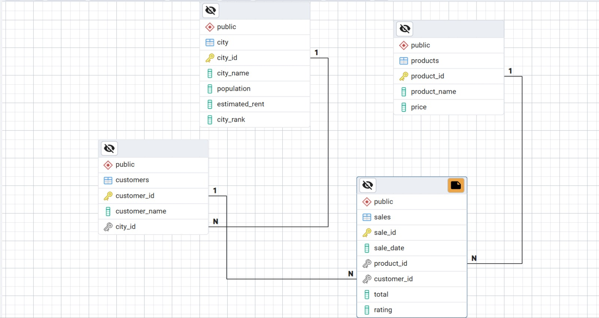

---
<p align="center">
  
</p>

<h1 align="center">☕ Monday Coffee – SQL Data Analysis Project</h1>

<p align="center">
  Data-driven market expansion analysis using SQL (CTEs, Window Functions, Business Insights)
</p>

---

## 📌 Project Overview

**Monday Coffee** is a fast-growing coffee brand launched in **January 2023**, currently operating through online sales across multiple Indian cities.

The company plans to expand by opening **three new coffee shops** in India’s major metro cities.

This project analyzes sales performance, customer behavior, and market potential to recommend the **top 3 cities for expansion**.

---

## 🎯 Business Objective

The company aims to:

- Expand operations by opening **3 new coffee outlets**
- Identify cities with the highest business potential based on:
  - Total Revenue  
  - Customer Demand  
  - Rent Affordability  
  - Product Performance  
  - Monthly Growth Trends  

---

## 🏗 Database Schema

The project uses four relational tables:

- **city**
- **customers**
- **products**
- **sales**

All tables are connected using primary and foreign key relationships.

---

## 🧩 Entity Relationship (ER) Diagram

The following ER diagram represents the relationship between **City**, **Customers**, **Products**, and **Sales** tables used in this project:

<p align="center">
  
</p>

---

# 📊 Key Business Questions & SQL Solutions

---

## 1. Coffee Consumers Count (25% Population)

How many people in each city are estimated to consume coffee, given that 25% of the population does?

```sql
SELECT 
    city_name,
    ROUND((population * 0.25)/1000000,2) AS coffee_consumers_in_millions,
    city_rank
FROM city
ORDER BY 2 DESC;
````

---

## 2. Total Revenue from Coffee Sales (Q4 2023)

What is the total revenue generated across all cities in the last quarter of 2023?

```sql
SELECT 
    SUM(total) AS total_revenue
FROM sales
WHERE 
    EXTRACT(YEAR FROM sale_date) = 2023
    AND EXTRACT(QUARTER FROM sale_date) = 4;
```

---

## 3. Sales Count for Each Product

How many units of each coffee product have been sold?

```sql
SELECT 
    p.product_name,
    COUNT(s.sale_id) AS sold_count
FROM sales s
JOIN products p
ON s.product_id = p.product_id
GROUP BY 1
ORDER BY 2 DESC;
```

---

## 4. Average Sales Amount per City

What is the average sales amount per customer in each city?

```sql
SELECT 
    ct.city_name,
    SUM(s.total) AS total_revenue,
    COUNT(DISTINCT s.customer_id) AS total_customers,
    ROUND(
        SUM(s.total)::numeric / COUNT(DISTINCT s.customer_id)::numeric, 2
    ) AS avg_sales_per_customer
FROM sales s
JOIN customers c
ON s.customer_id = c.customer_id
JOIN city ct
ON ct.city_id = c.city_id
GROUP BY 1
ORDER BY 2 DESC;
```

---

## 5. City Population and Coffee Consumers

Provide a list of cities along with their estimated coffee consumers and current customers.

```sql
WITH city_cte AS (
    SELECT 
        city_name,
        ROUND((population * 0.25)/1000000,2) AS coffee_consumers
    FROM city
),
customer_cte AS (
    SELECT 
        ct.city_name,
        COUNT(DISTINCT c.customer_id) AS current_customers
    FROM sales s
    JOIN customers c
    ON s.customer_id = c.customer_id
    JOIN city ct
    ON ct.city_id = c.city_id
    GROUP BY 1
)
SELECT 
    customer_cte.city_name,
    city_cte.coffee_consumers,
    customer_cte.current_customers
FROM city_cte
JOIN customer_cte
ON city_cte.city_name = customer_cte.city_name;
```

---

## 6. Top 3 Selling Products by City

What are the top 3 selling products in each city based on sales volume?

```sql
WITH cte AS (
    SELECT 
        ct.city_name,
        p.product_name,
        COUNT(s.sale_id) AS total_orders,
        DENSE_RANK() OVER(
            PARTITION BY ct.city_name 
            ORDER BY COUNT(s.sale_id) DESC
        ) AS rnk
    FROM sales s
    JOIN customers c
    ON s.customer_id = c.customer_id
    JOIN city ct
    ON ct.city_id = c.city_id
    JOIN products p
    ON s.product_id = p.product_id
    GROUP BY 1,2
)
SELECT *
FROM cte
WHERE rnk <= 3;
```

---

## 7. Customer Segmentation by City

How many unique customers are there in each city who have purchased coffee products?

```sql
SELECT
    ct.city_name,
    COUNT(DISTINCT c.customer_id) AS unique_customer_count
FROM city ct
JOIN customers c
ON ct.city_id = c.city_id
GROUP BY 1;
```

---

## 8. Average Sale vs Rent Analysis

Find each city’s average sale per customer and average rent per customer.

```sql
WITH customer_cte AS (
    SELECT 
        ct.city_name,
        SUM(total) AS total_revenue,
        COUNT(DISTINCT s.customer_id) AS total_customers,
        ROUND(SUM(total)::numeric / COUNT(DISTINCT s.customer_id)::numeric, 2)
        AS avg_sales_per_customer
    FROM sales s
    JOIN customers c
    ON s.customer_id = c.customer_id
    JOIN city ct
    ON ct.city_id = c.city_id
    GROUP BY 1
),
rent_cte AS (
    SELECT 
        ct.city_name,
        ROUND(ct.estimated_rent::numeric / COUNT(DISTINCT s.customer_id)::numeric, 2)
        AS avg_rent_per_customer
    FROM sales s
    JOIN customers c
    ON s.customer_id = c.customer_id
    JOIN city ct
    ON ct.city_id = c.city_id
    GROUP BY 1, ct.estimated_rent
)
SELECT 
    customer_cte.city_name,
    customer_cte.avg_sales_per_customer,
    rent_cte.avg_rent_per_customer
FROM customer_cte
JOIN rent_cte
ON customer_cte.city_name = rent_cte.city_name;
```

---

## 9. Monthly Sales Growth Rate

Calculate percentage growth (or decline) in sales month-over-month.

```sql
WITH monthly_sales AS (
    SELECT 
        ct.city_name,
        EXTRACT(MONTH FROM s.sale_date) AS sale_month,
        EXTRACT(YEAR FROM s.sale_date) AS sale_year,
        SUM(s.total) AS total_sales
    FROM sales s
    JOIN customers c
    ON s.customer_id = c.customer_id
    JOIN city ct
    ON ct.city_id = c.city_id
    GROUP BY 1,2,3
),
growth_cte AS (
    SELECT 
        city_name,
        sale_month,
        sale_year,
        total_sales AS current_month_sales,
        LAG(total_sales) OVER(
            PARTITION BY city_name 
            ORDER BY sale_year, sale_month
        ) AS last_month_sales
    FROM monthly_sales
)
SELECT 
    city_name,
    sale_month,
    sale_year,
    current_month_sales,
    last_month_sales,
    ROUND(
        (current_month_sales - last_month_sales)::numeric 
        / last_month_sales::numeric * 100, 2
    ) AS growth_percentage
FROM growth_cte
WHERE last_month_sales IS NOT NULL;
```

---

## 10. Market Potential Analysis (Top 3 Cities)

Identify the top 3 cities based on highest sales and expansion potential.

```sql
WITH city_sales AS (
    SELECT 
        ct.city_name,
        SUM(s.total) AS total_revenue,
        COUNT(DISTINCT s.customer_id) AS total_customers,
        ROUND(SUM(s.total)::numeric / COUNT(DISTINCT s.customer_id)::numeric, 2)
        AS avg_sale_per_customer
    FROM sales s
    JOIN customers c
    ON s.customer_id = c.customer_id
    JOIN city ct
    ON ct.city_id = c.city_id
    GROUP BY 1
),
city_rent AS (
    SELECT
        city_name,
        estimated_rent,
        ROUND((population * 0.25)/1000000,2) AS coffee_consumers
    FROM city
)
SELECT 
    cs.city_name,
    cs.total_revenue,
    cr.estimated_rent,
    cs.total_customers,
    cr.coffee_consumers,
    cs.avg_sale_per_customer,
    ROUND(cr.estimated_rent::numeric / cs.total_customers::numeric, 2)
    AS avg_rent_per_customer
FROM city_sales cs
JOIN city_rent cr
ON cs.city_name = cr.city_name
ORDER BY cs.total_revenue DESC
LIMIT 3;
```

---

# ⭐ Expansion Recommendations

Based on revenue, affordability, customer base, and market demand:

### 🥇 Pune

* Highest total revenue
* Low rent per customer
* Strong customer spending

### 🥈 Delhi

* Largest estimated consumer market (~7.7M)
* High customer count
* Affordable rent per customer

### 🥉 Jaipur

* Highest number of customers
* Lowest rent per customer
* Good average sales per customer

---

## 🛠 SQL Skills Used

* Joins (INNER, LEFT)
* Aggregations (`SUM`, `COUNT`, `AVG`)
* CTEs (`WITH`)
* Window Functions (`LAG`, `DENSE_RANK`)
* Business KPI Reporting
* Market Expansion Strategy

---

🙌 Author  
Ketan Kokitkar  
SQL & Data Analytics Enthusiast  

⭐ If you found this project useful, feel free to star the repository!

---
